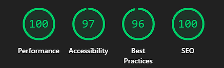
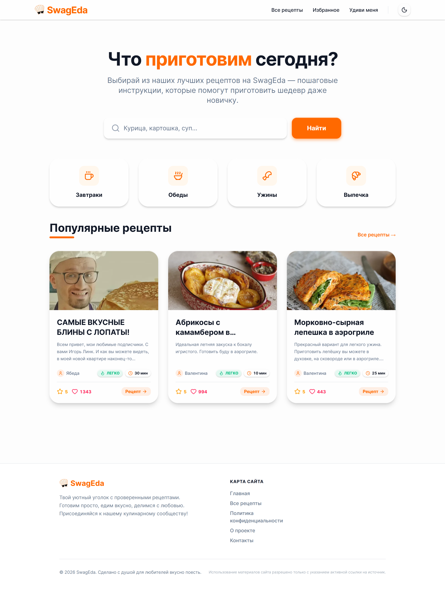
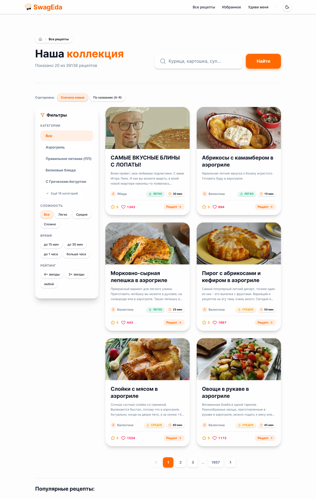
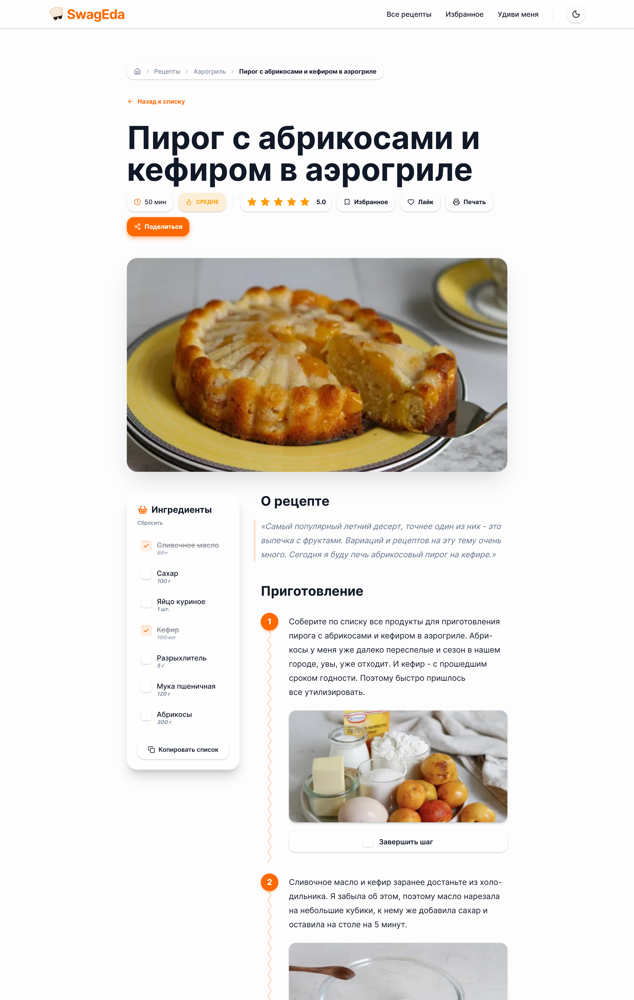

# 🍳 SwagEda — Modern Recipe Portal

<p align="center">
  <a href="README.ru.md">🇷🇺 Русская версия</a> | <b>🇺🇸 English Version</b>
</p>

<p align="center">✨ <a href="https://swageda.ru/">Live Demo</a></p>

[](https://astro.build)
[](https://tailwindcss.com)
[](https://www.typescriptlang.org/)
[](https://pagespeed.web.dev/)

**SwagEda** is a high-performance, production-grade recipe aggregator and portal built with a focus on speed, accessibility, and modern frontend engineering. It serves as a showcase for building scalable, SEO-friendly content platforms using **Astro** and **Tailwind CSS v4**.

This project demonstrates strong attention to detail in UX/UI, semantic web standards, state-of-the-art web performance optimization, and clean code practices.

---

## ✨ Features & Implemented Functionality

- **🧩 Clean Code & Component Architecture:** The project is meticulously structured into granular, highly cohesive UI components (`Button`, `Card`, `RatingStars`, etc.). This strict separation of concerns ensures that the codebase remains scalable, highly maintainable, and easy to extend or refactor in the future.
- **🚀 Extreme Performance:** Achieves near-instant page loads utilizing Astro's hybrid rendering. Employs Edge Caching (`stale-while-revalidate`) to serve recipe pages instantly without sacrificing dynamic data freshness.
- **🔍 Advanced Search & Discovery:** Real-time filtering by category, difficulty, and keywords across a vast database of 31,000+ recipes.
- **🌗 Smart Theme System:** Persistent Dark/Light mode utilizing Tailwind v4 CSS variables, respecting system preferences without FOUC (Flash of Unstyled Content).
- **⚡ Interactive Rating & Like System:** Built-in 5-star rating and "Like" functionality synchronized seamlessly with a backend API. Features local `localStorage` caching to provide instant visual feedback, custom beautifully styled Toast notifications for success/error states, and graceful handling of network failures.
- **📝 Smart Ingredients Checklist:** Interactive ingredient lists allowing users to check off items as they cook.
- **📹 Multimedia Support:** Integrated YouTube video player with "Text/Video" tab switching for a better user experience.
- **🖨️ Print Optimized:** Custom CSS media queries specifically engineered for printing recipes beautifully (strips UI clutter, optimizes layout).
- **🛡️ Secure API Proxy:** Custom Astro Middleware handles API request proxies to the Laravel backend, protecting sensitive headers and managing CORS/CSRF protections.

---

## 🛠 Tech Stack

- **Framework:** [Astro](https://astro.build/) (Hybrid Rendering: Static + SSR)
- **Styling:** [Tailwind CSS v4.0](https://tailwindcss.com/) (Using the modern `@theme` engine and CSS variables)
- **Language:** TypeScript (Strict Mode)
- **Icons:** [Iconify](https://iconify.design/) via `astro-icon`

---

## 🚀 Performance & Optimization

<p align="center">
  
</p>

- **Zero-JS Foundation:** The core content is delivered as pure HTML. JavaScript is only loaded and hydrated for interactive "islands" (like rating stars and theme togglers), drastically reducing the main thread load.
- **Advanced Caching:** Leverages HTTP `Cache-Control` headers and CDN Edge Caching to minimize TTFB (Time to First Byte).
- **Image Optimization:** Extensive use of `astro:assets` to serve images in Next-Gen formats (WebP/AVIF) with automatic lazy loading.

---

## ♿ Accessibility (A11y) & Semantic Web

- **Semantic HTML5:** Strict adherence to HTML5 landmarks (`<main>`, `<nav>`, `<article>`, `<aside>`) to ensure content is properly structured for screen readers.
- **ARIA Standards:** Proper implementation of `aria-live`, `aria-expanded`, `aria-pressed`, and `role` attributes across dynamic components (tabs, buttons, search, and rating systems).
- **Keyboard Navigation:** High-visibility focus rings (`focus-visible:ring-brand`) configured globally to ensure power users and visually impaired users can navigate purely via keyboard.
- **Color Contrast:** Meticulously chosen AA/AAA compliant color palettes tailored for both light and dark modes to guarantee readability.

---

## 🔍 SEO

- **JSON-LD Schema:** Every recipe page automatically generates rich `Recipe` and `BreadcrumbList` schema for Google Search Rich Snippets.
- **OpenGraph & Twitter Cards:** Dynamic meta-tag generation for beautiful, informative social media sharing.
- **Canonical Routing:** Strict canonical URL management to prevent duplicate content indexing.

---

## ⚙️ Installation & Instructions

### Prerequisites

- Node.js `>=22.12.0` (as defined in `package.json`)
- npm, pnpm, or yarn

### Getting Started

1. **Clone the repository:**

   ```bash
   git clone https://github.com/KbrYbk/recipe-frontend.git
   cd recipe-frontend
   ```

2. **Install dependencies:**

   ```bash
   npm install
   ```

3. **Configure Environment Variables:**
   Create a `.env` file based on the provided `.env.example`:

   ```bash
   cp .env.example .env
   ```

   _Make sure to populate your API endpoints and project keys appropriately._

4. **Start the development server:**

   ```bash
   npm run dev
   ```

   The site will be available at `http://localhost:4321`.

5. **Build for Production:**
   ```bash
   npm run build
   ```
   The production-ready Node.js server build will be generated in the `dist/` directory.

---

## 📂 Project Architecture

```text
src/
├── components/     # Modular, reusable UI components (Buttons, Cards, Ratings)
├── layouts/        # Base layouts with Meta/SEO and Theme initialization
├── lib/            # Shared utilities, TS interfaces, and API clients
├── middleware.ts   # Astro Middleware for API proxying and security headers
├── pages/          # File-based routing (Static & SSR endpoints)
├── styles/         # Global Tailwind v4 configuration and base CSS
└── types/          # Strict TypeScript interfaces for data models
```

---

## 🖼 Screenshots & Themes

The project features full support for Light and Dark modes, which can be toggled instantly without reloading (utilizing Tailwind v4 CSS variables).

### Desktop View

<h4 align="center">Home Page</h4>

| Light Theme | Dark Theme |
| :---: | :---: |
|  |  |

<h4 align="center">All Recipes (Catalog)</h4>

| Light Theme | Dark Theme |
| :---: | :---: |
|  |  |

<h4 align="center">Recipe Detail</h4>

| Light Theme | Dark Theme |
| :---: | :---: |
|  |  |

### Mobile View (iPhone)

| Light Theme | Dark Theme |
| :---: | :---: |
|  |  |
