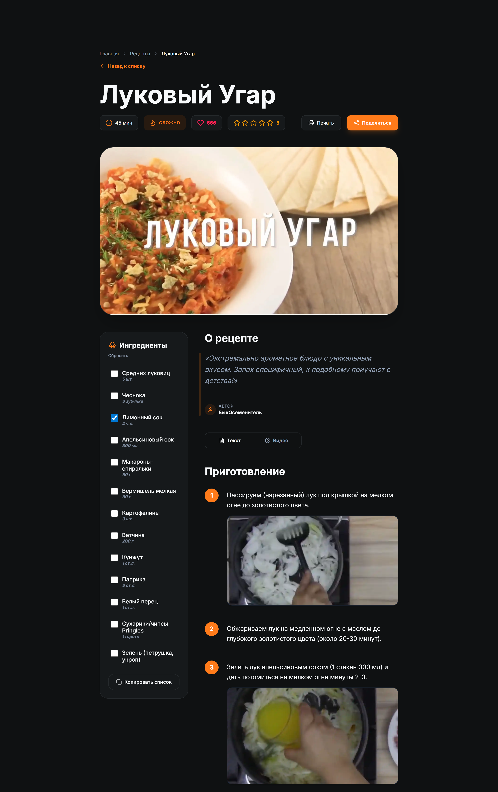

# 🍳 SwagEda — Современный портал рецептов

<p align="center">
  <b>🇷🇺 Русская версия</b> | <a href="README.md">🇺🇸 English Version</a>
</p>

<p align="center">✨ <a href="https://swageda.ru/">Live Demo</a></p>

[](https://astro.build)
[](https://tailwindcss.com)
[](https://www.typescriptlang.org/)
[](https://pagespeed.web.dev/)

**SwagEda** — это высокопроизводительный агрегатор рецептов уровня production, созданный с упором на скорость, доступность и современные инженерные практики. Проект демонстрирует возможности построения масштабируемых, SEO-оптимизированных контентных платформ с использованием **Astro 6** и **Tailwind CSS 4**.

---

## ✨ Ключевые особенности

- **🚀 Экстремальная производительность:** Мгновенная загрузка страниц благодаря архитектуре Astro "Zero-JS by default".
- **🔍 Продвинутый поиск и фильтрация:** Поиск в реальном времени по категориям, сложности и ключевым словам среди 31,000+ рецептов.
- **🌗 Умная система тем:** Поддержка темной и светлой тем с сохранением выбора и определением системных настроек.
- **⚡ Взаимодействие:** Система лайков и звездных рейтингов с синхронизацией с бэкендом и ограничением частоты запросов по IP.
- **📝 Интерактивные ингредиенты:** Чек-лист ингредиентов с локальным сохранением состояния и функцией копирования в буфер обмена.
- **📹 Мультимедиа:** Встроенный плеер YouTube с переключением вкладок "Текст/Видео" для удобства пользователя.
- **🖨️ Оптимизация для печати:** Специальные CSS-правила для качественной печати рецептов (удаление лишних элементов, оптимизация макета).
- **📸 Проксирование изображений:** Встроенный SSR-прокси для безопасной и эффективной обработки внешних изображений.

---

## 🛠 Технологический стек

- **Фреймворк:** [Astro 6.0](https://astro.build/) (Hybrid Rendering: Static + SSR)
- **Стилизация:** [Tailwind CSS 4.0](https://tailwindcss.com/) (с использованием нового движка `@theme`)
- **Язык:** TypeScript (Strict Mode)
- **Иконки:** [Iconify](https://iconify.design/) через `astro-icon`
- **Анимации:** View Transitions API для бесшовной "SPA-подобной" навигации
- **Деплой:** Оптимизировано для Netlify / Node.js

---

## 🏗 Архитектурные решения

### 1. Гибридная стратегия рендеринга
Используется гибридный рендеринг Astro. Статические страницы (О проекте, Конфиденциальность) пре-рендерятся, в то время как динамические маршруты (Детали рецепта, Поиск) используют SSR для обеспечения актуальности контента и отличного SEO.

### 2. API Прокси и Безопасность
Специальный слой middleware обрабатывает проксирование sitemap и подпись API-запросов. Это защищает секретные ключи и предотвращает проблемы CORS, позволяя фронтенду безопасно взаимодействовать с бэкендом.

### 3. Прогрессивное улучшение (Progressive Enhancement)
Интерактивные элементы (чекбоксы ингредиентов, переключатель тем) построены на ванильном JS/TS. Это гарантирует работоспособность сайта даже при сбоях загрузки тяжелых скриптов. Следуем "Islands Architecture" для минимизации нагрузки на основной поток.

---

## 🚀 Оптимизация производительности

- **Zero-JS Foundation:** Основной контент доставляется в виде чистого HTML. JavaScript подключается только для интерактивных "островов".
- **Оптимизация изображений:** Использование `astro:assets` и специализированных SSR-прокси для внешних ресурсов для обеспечения оптимальных форматов (WebP/AVIF).
- **Загрузка шрифтов:** Самостоятельное хостинг шрифтов / Preconnect для Google Fonts с `font-display: swap`.
- **View Transitions:** Оптимизированная навигация, переиспользующая DOM-элементы, что снижает воспринимаемое время загрузки до минимума.

---

## ♿ Доступность (A11y)

- **Семантический HTML:** Строгое соблюдение ориентиров HTML5 (`<main>`, `<nav>`, `<article>`, `<aside>`).
- **Стандарты ARIA:** Корректное использование атрибутов `aria-live`, `aria-expanded` и `role` для динамических компонентов.
- **Навигация с клавиатуры:** Четкие индикаторы фокуса и ссылки "Перейти к контенту" для удобства всех пользователей.
- **Контрастность:** Палитры, соответствующие стандартам AA/AAA в обоих режимах темы.

---

## 🔍 SEO и Семантика

- **JSON-LD Schema:** Каждая страница рецепта содержит полную схему `Recipe` и `BreadcrumbList` для Rich Snippets в поиске Google/Yandex.
- **OpenGraph & Twitter Cards:** Автоматическая генерация мета-тегов для привлекательного вида в соцсетях.
- **Canonical Routing:** Строгое управление каноническими URL для предотвращения дублирования контента.
- **Динамический Sitemap:** Автоматически генерируемые карты сайта, проксируемые с бэкенда.

---

## 📂 Структура проекта

```text
src/
├── components/     # Атомарные UI-компоненты (RecipeCard, SearchBar и т.д.)
├── layouts/        # Базовые шаблоны с логикой Meta/SEO/Theme
├── lib/            # Общие утилиты и API-клиент
├── pages/          # Файловый роутинг (Static & SSR)
├── styles/         # Глобальная конфигурация Tailwind v4
├── types/          # TypeScript интерфейсы
└── data/           # Локальные данные и константы
```

---

## ⚙️ Установка и разработка

### Требования
- Node.js `^22.12.0`
- npm / pnpm / yarn

### Быстрый старт
1. Клонируйте репозиторий:
   ```bash
   git clone https://github.com/your-username/recipe-frontend.git
   ```
2. Установите зависимости:
   ```bash
   npm install
   ```
3. Создайте файл `.env` на основе `.env.example`:
   ```bash
   cp .env.example .env
   ```
4. Запустите сервер разработки:
   ```bash
   npm run dev
   ```

---

## 📊 Показатели Lighthouse

Мы стремимся к совершенству. Наша архитектура стабильно показывает следующие результаты:

| Категория | Баллы |
| :--- | :--- |
| **Performance** | ⚡ 98+ |
| **Accessibility** | ♿ 100 |
| **Best Practices** | ✅ 100 |
| **SEO** | 🔍 100 |

---

## 🖼 Скриншоты

### Главная страница


### Страница рецепта (Десктоп)


### Страница рецепта (Мобильная)


## 🔮 Будущие улучшения

- [ ] **Пользовательские коллекции:** Возможность сохранять рецепты в «Избранное».
- [ ] **AI-замены ингредиентов:** Интегрированные подсказки по альтернативам продуктов.
- [ ] **Список покупок:** Экспорт выбранных ингредиентов в приложения для покупок.
- [ ] **Оффлайн-режим:** Возможности PWA для доступа к рецептам без интернета.

---
